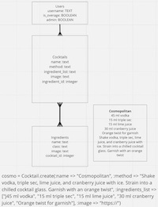

# BARPRETENDER
Project on live [coming soon]
## MOTIVATION
BarPretender is a cocktail recipe app. It has two features. The one feature is that an user can  choose a cocktail from a list to access a recipe. Another feature enables users to select some ingredients they have at hand and list out what cocktails can be made with selected ingredients.
## ABOUT
- BarPretender was developed with Ruby on Rails 5.2.8.1 on the backend and React on the frontend.
- Gems used for this projects are:
    - bcrypt
    - jwt
    - rack-cors
    - pg
- In order to install on the local machine after cloning the project please run bundle install command in the terminal.
- This project utilisez Rails as the backend server to handle data storage, retrieval and API endpoints. The React app hadles the frontend user interface and interactions.
- There are 4 database, users, cocktails, ingredients and cocktails_ingredients.
- Postgresql is used for the database system.
- schema.rb explans the associations between those tables.

## PLANNING AND APPROACHES
- BarPredender was a group project built as Project 2 for Software Engineering Immersive course at General Assembly
- As a group we spent some time to plan both backend and frontend together.
this is the working tree we have worked off.

## FURTHER IMPROVEMENTS
- Currently only the admin can make contributions to the app through create/edit/delete functions. In the futre this feature can be extended to the users by associating users to cocktails.
- Adding 'forget username, password' feature.
- Further interactions with the user can be implemented. For example user can like/dilike cocktails or can add comments to be more interactive.
## LESSONS LEARNT
- How to work as a team efficiently by taking advantages of the strength of individual collaboratiors.
- How to use version control- this took a lot of our time to work,  and there are improvements to be made to use this  more competently.
- Communication between individual member is crucial to the workflow and goal achievement.
- Acknowledging different ways of programming.
## Credit
[flatiocon](https://www.flaticon.com/) - Provided icons for ingredients list in the app.

We would like to thank each other for working well together by being dedicated team memebers. We would also like to thank the teaching team, cohort and friends to support us to come this project alive.
